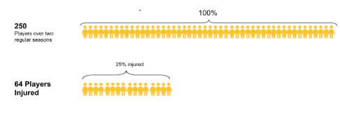
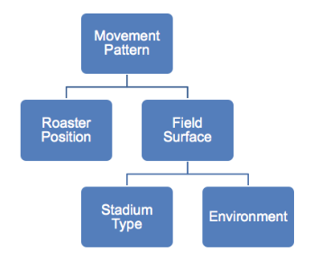
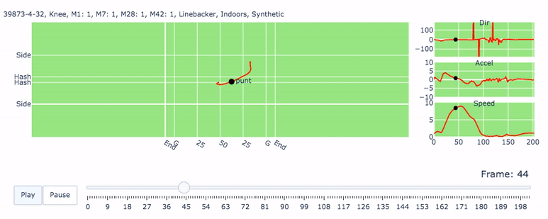
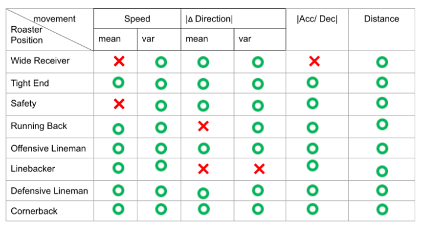

```{r setup, include=FALSE}
knitr::opts_chunk$set(echo = TRUE, warning = FALSE, message = FALSE)
```

```{r, eval = FALSE}
packages.used=c("tidyverse", "ggplot2","vcd","ggmosaic","GGally","lubridate","scales","DMwR","gridExtra")
# check packages that need to be installed.
packages.needed=setdiff(packages.used, 
                        intersect(installed.packages()[,1], 
                                  packages.used))
# install additional packages
if(length(packages.needed)>0){
  install.packages(packages.needed, dependencies = TRUE)
}
```

```{r}
# load packages
library(tidyverse)
library(ggplot2)
library(vcd)
library(ggmosaic)
library(GGally)
library(lubridate)
library(scales)
library(DMwR)
library(gridExtra)
```

## Data Introduction

Injury Record: The injury record file contains information on 105 lower-limb injuries that occurred during regular season games over the two seasons.

Play list: The playlist file contains the details for the over 260 thousand player-plays that makeup the dataset. Details about the game and play include the player’s assigned roster position, stadium type, field type, weather, play type and so on.

Player Track Data has player level data that describes the location, orientation, speed and direction of each player during a play recorded at 10 Hz( i.e 10 observations recorded per second.)




We are trying to analyze (National Football League)NFL non-contact lower-limb injury data over 2 regular seasons, and to identify different player movements on different field surfaces, weather, positions and etc that may influence the risk of injury. 

## Data Processing 

Since the dataset is pretty imbalanced, with 99.97% non-injured tracks and 0.03% injured tracks. We decide to apply SMOTE method to make the data reach 3:2 of non-injured to injured tracks, which is similar to the ratio of non-injured players vs. injured players. In particular, this method regenerates minority and samples from majority. 

```{r,eval=F, echo=T}
## Pre-processing the dataset 
NFL_data_new$indicator <- as.factor(NFL_data_new$indicator)
##Using SMOTE method to generate minority dataset and sample from majority
## in respond to proportion of injured player percentage
NFL_data_resample <- SMOTE(indicator ~ ., NFL_data_new, perc.over = 4900, k=5, perc.under=300)

print(table(NFL_data_resample$indicator))
print(prop.table(table(NFL_data$indicator)))

NFL_data_resample$indicator <- ifelse(NFL_data_resample$indicator==0,"non-injured","injured")
print(table(NFL_data_resample$indicator))
save(NFL_data_resample, file="../output/NFL_data_resample.RData")
```


```{r}
load('../output/NFL_data_resample.RData') 
InjuryRecord <- read.csv("../data/InjuryRecord.csv")
PlayList <- read.csv("../data/PlayList.csv")
# PlayerTrackData <- read.csv("../data/PlayerTrackData.csv")
```

## Logic Tree

We do analysis base on the following logic.



## One Track Animation (Injured)

Instead of one single player, we take one single track of player movements as the basic unit. Because environment changes and the players change their movement patterns in each game.


Here, we display an example of an injured player’s track. We locate the instant location (change by 10hz) of this player on the left-hand side, while on the right-hand-side, we have direction, acceleration, speed for each time break.



## Roaster Position

```{r}
unique.player<-duplicated(PlayList$PlayerKey)
dat_palyer <- PlayList[!unique.player,]
dat_palyer$indicator <- ifelse(dat_palyer$PlayerKey %in% InjuryRecord$PlayerKey, "Injured", "Non-Injured")
```

```{r injured vs. non injured in different roster postion}
plot_cols <- c("#498972", "#3E8193", "#BC6E2E", "#A09D3C", "#E06E77", "#7589BC", "#A57BAF", "#4D4D4D")
dat_palyer %>% 
  ggplot(aes(x=RosterPosition, fill = indicator, colour = indicator)) +
  geom_bar(stat = "count", position = "fill", alpha = 0.6) +
  scale_fill_manual(values = plot_cols[c(3,2)]) +
  scale_colour_manual(values = plot_cols[c(3,2)]) +
  scale_y_continuous(labels = percent) + labs(x = "Roster Position", y="Percentage")+
  ggtitle("Injured vs. Non-Injured for Different Roster Position") + coord_flip()

table(dat_palyer$RosterPosition,dat_palyer$indicator)

fisher.test(table(dat_palyer$RosterPosition, dat_palyer$indicator),workspace = 2e8)
```

From the stacked bar plot, we propose that there is an association between injured cases and with different Roster Positions. the later fisher’s exact test proves our hypothesis.

### a. Roaster Position + Speed mean and variance

```{r}
ggplot(NFL_data_resample,aes(x=RosterPosition,y=mean_speed,fill=indicator)) +
  geom_boxplot() +
  scale_fill_manual(values = plot_cols[c(3,2)]) +
  scale_colour_manual(values = plot_cols[c(3,2)]) +
  labs(x="RosterPosition",y="Speed Mean")+
  ggtitle("Roster Position + Speed Mean") +
  coord_flip()

ggplot(NFL_data_resample,aes(x=RosterPosition,y=var_speed,fill=indicator)) +
  geom_boxplot() +
  scale_fill_manual(values = plot_cols[c(3,2)]) +
  scale_colour_manual(values = plot_cols[c(3,2)]) +
  labs(x="RosterPosition",y="Speed Variance")+
  ggtitle("Roster Position + Speed Variance") +
  coord_flip()
```

We studied movement patterns of injury/noninjury tracks for each roster position.
You can see from these plots, tight ends, running backs and linebackers tend to have larger average speed and greater deviance during their injured tracks than non-injured tracks. 

### b. Roaster Position + |ΔDirection| mean, variance

```{r}
ggplot(NFL_data_resample,aes(x=RosterPosition,y=mean_dir,fill=indicator)) +
  geom_boxplot() +
  scale_fill_manual(values = plot_cols[c(3,2)]) +
  scale_colour_manual(values = plot_cols[c(3,2)]) +
  labs(x="RosterPosition",y="Direction Change Mean")+
  ggtitle("Roster Position + Direction Change Mean") +
  coord_flip()

ggplot(NFL_data_resample,aes(x=RosterPosition,y=var_dir,fill=indicator)) +
  geom_boxplot() +
  scale_fill_manual(values = plot_cols[c(3,2)]) +
  scale_colour_manual(values = plot_cols[c(3,2)]) +
  labs(x="RosterPosition",y="Direction Change Variance")+
  ggtitle("Roster Position + Direction Change Variance") +
  coord_flip()
```

Similar patterns were shown for absolute angle changes of player motion.


### c. Roaster Position + |ACC/DEC|

```{r}
ggplot(NFL_data_resample,aes(x=RosterPosition,y=mean_acc,fill=indicator)) +
  geom_boxplot() +
  scale_fill_manual(values = plot_cols[c(3,2)]) +
  scale_colour_manual(values = plot_cols[c(3,2)]) +
  labs(x="RosterPosition",y="Acceleration(Deceleration) Mean")+
  ggtitle("Roster Position + Acceleration(Deceleration) Mean") +
  coord_flip()
```

Telling from the roaster position + |acceleration/deceleration| plot, we noticed that players in their injured tracks are more likely to accelerate and decelerate suddenly


### d. Roaster Position + Distance

```{r}
ggplot(NFL_data_resample,aes(x=RosterPosition,y=sum_dis,fill=indicator)) +
  geom_boxplot() +
  scale_fill_manual(values = plot_cols[c(3,2)]) +
  scale_colour_manual(values = plot_cols[c(3,2)]) +
  labs(x="RosterPosition",y="Sum Distance")+
  ggtitle("Roster Position + Sum Distance") +
  coord_flip()
```

For the total distance of each track, majority positions’ players tend to run a longer distance during their injured tracks.




From our previous discussions, this player movement matrix can capture significant differences between injury tracks and noninjury tracks across majority of roaster positions


## Field Surface
```{r}
NFL_data_resample%>% 
  ggplot(aes(x=FieldType, fill = indicator, colour = indicator)) +
  geom_bar(stat = "count", position = "fill", alpha = 0.6) +
  scale_fill_manual(values = plot_cols[c(3,2)]) +
  scale_colour_manual(values = plot_cols[c(3,2)]) +
  scale_y_continuous(labels = percent) + labs(x = "FieldType", y="Percentage")+
  ggtitle("Injury Situation in Different FieldType") + coord_flip()

table(NFL_data_resample$indicator, NFL_data_resample$FieldType)

chisq.test(table(NFL_data_resample$indicator, NFL_data_resample$FieldType))
```

Another important feature that might relates to football injury is field surface (synthetic turf or natural turf)
We apply chi-square test and conclude that there is a significant correlation between field surface injury cases.

Recent investigations of lower limb injuries among football athletes have indicated significantly higher injury rates on synthetic turf compared with natural turf because that synthetic turf surfaces do not release cleats as readily as natural turf and may contribute to the incidence of non-contact lower limb injuries (Kent et al., 2015). 


## Logistic Regression
```{r}
NFL_data_resample_subset <- NFL_data_resample[NFL_data_resample$Weather!="indoors" | NFL_data_resample$StadiumType %in% c("dome_closed","indoor_closed"),]
NFL_data_resample_subset <- NFL_data_resample_subset[NFL_data_resample_subset$Weather!="unknown",]
NFL_data_resample_subset$indicator <- ifelse(NFL_data_resample_subset$indicator=="non-injured",0,1)
## Consider environment 
NFL_data_resample_subset$Indoor <- ifelse(NFL_data_resample_subset$StadiumType %in% c("dome_closed","indoor_closed") | NFL_data_resample_subset$Weather=="indoors",1,0)
NFL_data_resample_subset$Outdoor_rain  <- ifelse(NFL_data_resample_subset$StadiumType == "Outdoor" & NFL_data_resample_subset$Weather=="rain",1,0)
NFL_data_resample_subset$Outdoor_overcast  <- ifelse(NFL_data_resample_subset$StadiumType == "Outdoor" & NFL_data_resample_subset$Weather=="overcast",1,0)
NFL_data_resample_subset$Outdoor_clear  <- ifelse(NFL_data_resample_subset$StadiumType == "Outdoor" & NFL_data_resample_subset$Weather=="clear",1,0)
NFL_data_resample_subset$Outdoor_snow  <- ifelse(NFL_data_resample_subset$StadiumType == "Outdoor" & NFL_data_resample_subset$Weather=="snow",1,0)
NFL_data_resample_subset$Indoor_rain  <- ifelse(NFL_data_resample_subset$StadiumType %in% c("dome_open","indoor_open") & NFL_data_resample_subset$Weather=="rain",1,0)
NFL_data_resample_subset$Indoor_overcast  <- ifelse(NFL_data_resample_subset$StadiumType %in% c("dome_open","indoor_open") & NFL_data_resample_subset$Weather=="overcast",1,0)
NFL_data_resample_subset$Indoor_clear  <- ifelse(NFL_data_resample_subset$StadiumType %in% c("dome_open","indoor_open") & NFL_data_resample_subset$Weather=="clear",1,0)
NFL_data_resample_subset$Indoor_snow  <- ifelse(NFL_data_resample_subset$StadiumType %in% c("dome_open","indoor_open") & NFL_data_resample_subset$Weather=="snow",1,0)

fit <- glm(indicator ~ sum_dis + mean_speed + var_speed + mean_dir + var_dir + mean_acc + FieldType + Temperature + Indoor + Outdoor_rain + Outdoor_overcast + Outdoor_clear + Outdoor_snow, 
             data = NFL_data_resample_subset, family = "binomial")
summary(fit)
```

Finally, we combine the potential influential features Movement Pattern, Field Surface and Environment together to fit a logistic regression. Most predictors are highly significant. Based on this result, we may have the following conclusion. Lower acceleration, Natural turfs, and warmer temperatures are safer.

Based on our findings, we make some suggestions for both players and the NFL during the winter season. For the players, they need to have sufficient warm-ups and avoid sudden acceleration/deceleration. For the NFL, it is better to hold more games on natural turfs. 

